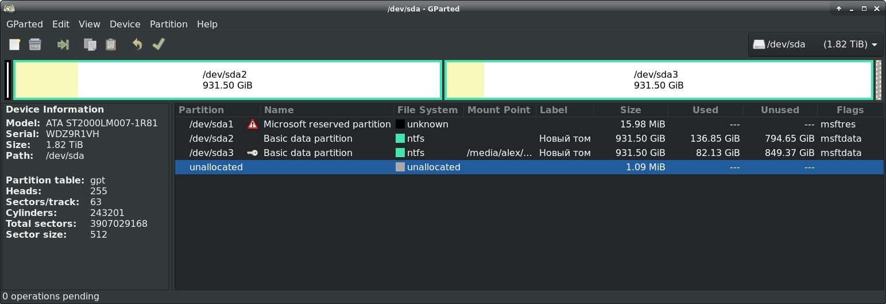

# Звіт з лабораторної роботи №1 за дисципліною "Unix-подібні операційні системи" студента групи ПА-18-2 Лобань Ганни Максимівни Кафедра комп'ютерних технологій ФПМ, ДНУ, 2020-2021 навч.р. 

## Main File Sysmems Used by Windows and Unix

### NTFS (New Technology File System)

NTFS provides a combination of performance, reliability, and compatibility not found in the FAT file system.
It is designed to quickly perform standard file operations such as read, write, and search — and even advanced
operations such as file-system recovery — on very large hard disks.
 
### FAT (File Allocation Table)

FAT is a file system developed for personal computers. Originally developed in 1977 for use on floppy disks,
it was adapted for use on hard disks and other devices. It is often supported for compatibility reasons by
current operating systems for personal computers and many mobile devices and embedded systems, allowing interchange
of data between disparate systems. Initially used on DOS and Microsoft Windows and now widely used for portable USB
storage and some other devices; FAT12, FAT16 and FAT32 for 12-, 16- and 32-bit table depths.

#### VFAT

VFAT – Optional layer on Microsoft Windows FAT system to allow long (up to 255 character) filenames instead of only
the 8.3 filenames allowed in the plain FAT filesystem.
#### FATX

FATX – A modified version of Microsoft Windows FAT system that is used on the original Xbox console.
 
### EXT (Extended File System)

Extended file system designed for Linux systems. It was implemented in April 1992 as the first file system created
specifically for the Linux kernel. It has metadata structure inspired by traditional Unix filesystem principles, and
was designed by Rémy Card to overcome certain limitations of the MINIX file system. It was the first implementation
that used the virtual file system (VFS), for which support was added in the Linux kernel in version 0.96c, and it could
handle file systems up to 2 gigabytes (GB) in size.

* EXT2 – Second extended file system, designed for Linux systems.
* EXT3 – A journaled form of ext2.
* EXT4 – A follow up for ext3 and also a journaled filesystem with support for extents.
* EXT3COW – A versioning file system form of ext3.

### Minix File System

Used for Minix systems. It was written from scratch by Andrew S. Tanenbaum in the 1980s and aimed to replicate the
structure of the Unix File System while omitting complex features, and was intended to be a teaching aid. It largely
fell out of favor among Linux users by 1994 due to the popularity of other filesystems - most notably ext2 - and its
lack of features, including limited partition sizes and filename length limits.

### APFS (Apple File System)

APFS is a proprietary file system for macOS High Sierra (10.13) and later, iOS 10.3 and later, tvOS 10.2 and later,
watchOS 3.2 and later, and all versions of iPadOS, developed and deployed by Apple Inc. It aims to fix core problems
of HFS+ (also called Mac OS Extended), APFS's predecessor on these operating systems. Apple File System is optimized
for flash and solid-state drive storage, with a primary focus on encryption.
APFS.

## Local Disk Analysis Via GParted

[]

[![SSD 256 MiB(02.png)]

## Popular Linux Distributions

.

## Where *nix System Are Used And How

### Minix

Minix (from "mini-Unix") is a POSIX-compliant (since version 2.0), Unix-like operating
system based on a microkernel architecture.

Early versions of MINIX were created by Andrew S. Tanenbaum for educational purposes.
Starting with MINIX 3, the primary aim of development shifted from education to the creation
of a highly reliable and self-healing microkernel OS. MINIX is now developed as open-source software.

MINIX was first released in 1987, with its complete source code made available to
universities for study in courses and research. It has been free and open-source software
since it was re-licensed under the BSD license in April 2000.

All Intel chipsets post-2015 are running MINIX 3 internally as the software component of the Intel Management Engine.

### Linux

Linux kernel-based operating systems have been widely adopted in a very wide range of uses. All
the advantages and benefits of free and open-source software apply to the Linux kernel, and to
most of the rest of the system software.

The common human interface devices (HIDs) available for desktop computers, laptops and similar
devices determine the design of the (graphical) human-computer interface implemented in software.
There are a few software packages to choose among, when building an accordingly designed graphical
user interface. The generic input driver for the Linux kernel is evdev, but here are several input
methods implemented as middleware, i.e., atop and not as part of the Linux kernel.

The Linux kernel has gained wide use in operating systems used in embedded systems, as real-time
and non-real-time variants.

Patches exist which transform the Linux kernel into a real-time kernel, termed a real-time operating
system (RTOS). Several are actively maintained. Minimally, such an operating system includes a more
or less modified Linux kernel, uClibc and BusyBox.

Non-RTOS variants exist. OpenWrt, which is also a Linux distribution, is for use on customer-premises
equipment (CPE) devices like wireless routers. Rockbox, which is based on μClinux, is an operating
system for portable media players.

All the fastest supercomputers in the decade since the Earth Simulator have used Linux. Linux also
ran on the first teraFLOPS supercomputer, ASCI Red in 1997, and on IBM Roadrunner in 2008, which
was the first petascale computer.

As of January 2018, 500 or 100% of the world's fastest supercomputers run an operating system based
on the Linux kernel. The world’s fastest supercomputer is China’s Sunway TaihuLight, is powered by
a colossal 650,000+ CPUs, runs a customised version of Linux called ‘Sunway RaiseOS’, with processing
speed of 93 petaflops.

### FreeBSD

FreeBSD is a free and open-source Unix-like operating system descended from the Berkeley Software
Distribution (BSD), which was based on Research Unix. The first version of FreeBSD was released in
1993. In 2005, FreeBSD was the most popular open-source BSD operating system, accounting for more
than three-quarters of all installed simply, permissively licensed BSD systems.

The FreeBSD project includes a security team overseeing all software shipped in the base distribution.
A wide range of additional third-party applications may be installed using the pkg package management
system or FreeBSD Ports, or by compiling source code.

Much of FreeBSD's codebase has become an integral part of other operating systems such as Darwin (the
basis for macOS, iOS, iPadOS, watchOS, and tvOS), TrueNAS (an open-source NAS/SAN operating system),
and the system software for the PlayStation 3 and PlayStation 4 game consoles.

FreeBSD contains a significant collection of server-related software in the base system and the ports
collection, allowing FreeBSD to be configured and used as a mail server, web server, firewall, FTP
server, DNS server and a router, among other applications.

FreeBSD can be installed on a regular desktop or a laptop. The X Window System is not installed by
default, but is available in the FreeBSD ports collection. A number of desktop environments such as
GNOME, KDE, and Xfce, as well as lightweight window managers such as Openbox, Fluxbox, and dwm, bspwm,
are also available to FreeBSD. As of FreeBSD 12, support for a modern graphics stack is available via
drm-kmod. A large number of wireless adapters are supported.

Although it explicitly focuses on the x86-32 and x86-64 platforms, FreeBSD also supports others such as
ARM, PowerPC and MIPS to a lesser degree.

### OpenBSD

OpenBSD is a security-focused, free and open-source, Unix-like operating system based on the Berkeley
Software Distribution (BSD). Theo de Raadt created OpenBSD in 1995 by forking NetBSD. According to
the website, the OpenBSD project emphasizes "portability, standardization, correctness, proactive
security and integrated cryptography."

The OpenBSD project maintains portable versions of many subsystems as packages for other operating
systems. Because of the project's emphasis on code quality, many components are reused in other
software projects. Android's Bionic C standard library is based on OpenBSD code, LLVM uses OpenBSD's
regular expression library, and Windows 10 uses OpenSSH (OpenBSD Secure Shell) with LibreSSL.

The word "open" in the name OpenBSD refers to the availability of the operating system's source code
on the Internet, although the word "open" in the name OpenSSH means "OpenBSD". It also refers to the
wide range of hardware platforms the system supports.

OpenBSD features a robust TCP/IP networking stack, and can be used as a router or wireless access point.
OpenBSD's security enhancements, built-in cryptography, and packet filter make it suitable for security
purposes such as firewalls, intrusion-detection systems, and VPN gateways.

Several proprietary systems are based on OpenBSD, including devices from Armorlogic (Profense web application
firewall), Calyptix Security, GeNUA, RTMX, and .vantronix.

Some versions of Microsoft's Services for UNIX, an extension to the Windows operating system to provide
Unix-like functionality, use much OpenBSD code included in the Interix interoperability suite, developed
by Softway Systems Inc., which Microsoft acquired in 1999. Core Force, a security product for Windows,
is based on OpenBSD's pf firewall.

OpenBSD ships with Xenocara, an implementation of the X Window System, and is suitable as a desktop operating
system for personal computers, including laptops. As of September 2018, OpenBSD includes approximately 8000
packages in its software repository, including desktop environments such as GNOME, Plasma 4, and Xfce, and
web browsers such as Firefox and Chromium. The project also includes three window managers in the main
distribution: cwm, FVWM (part of the default configuration for Xenocara), and twm.

OpenBSD features a full server suite and can be configured as a mail server, web server, FTP server, DNS
server, router, firewall, NFS file server, or any combination of these.
