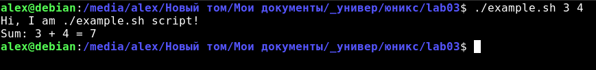
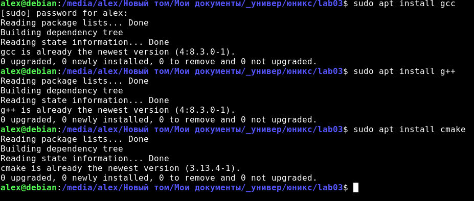
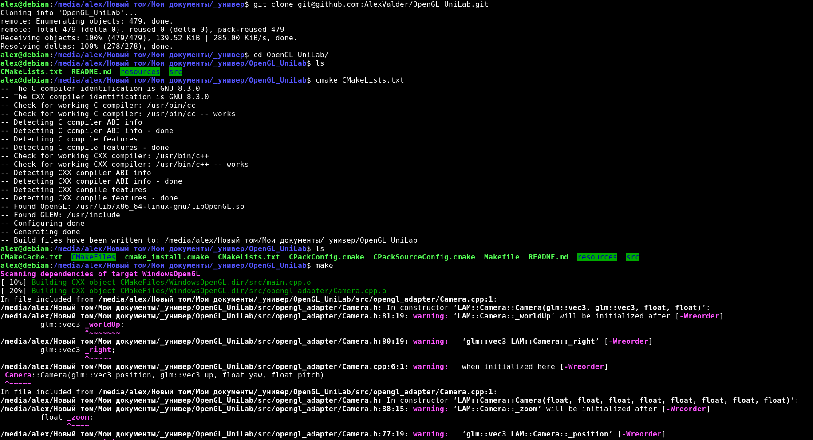
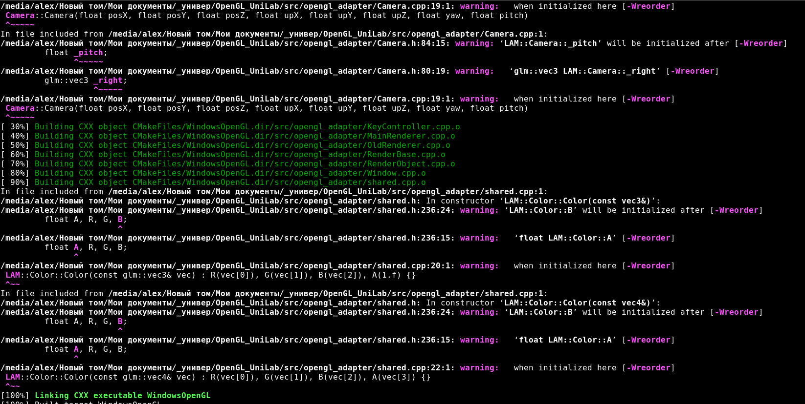
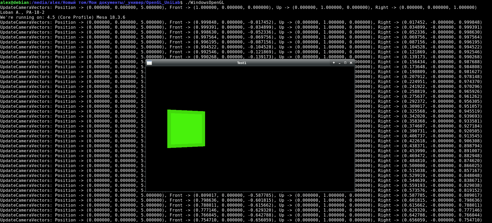
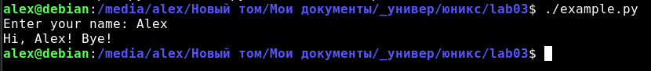
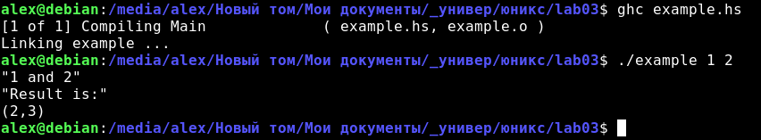
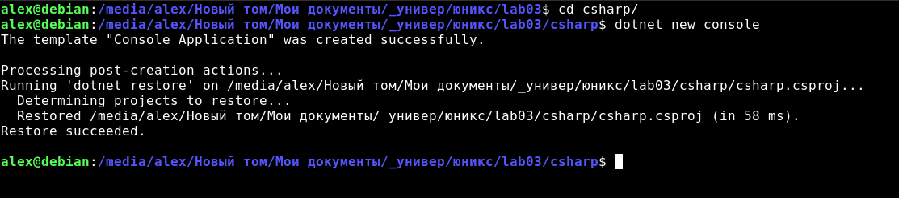
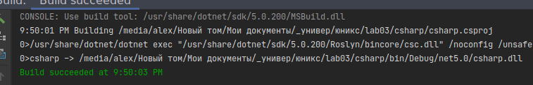
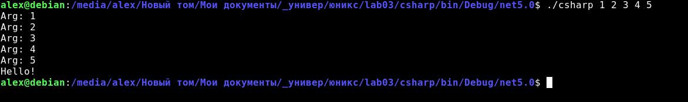

# Звіт з лабораторної роботи №2<br>за дисципліною "Unix-подібні операційні системи"<br>студента групи ПА-18-2<br>Лобань Ганни Максимівни<br>Кафедра комп'ютерних технологій<br>ФПМ, ДНУ, 2020-2021 навч.р.<br>

## Написати Bash скрипт, який приймає певні аргументи

Для цього я візьму простий скрипт, який виводить свою назву та сумує свої два цілочисельні аргументи [example.sh](./example.sh):

```bash
#!/bin/bash

echo "Hi, I am ${0} script!"
sum=$(($1+$2))
echo "Sum: ${1} + ${2} = ${sum}"
```
Приклад використання:



## Написати програму на мові C чи на мові C++. Встановити компілятор gcc/g++ та скомпілювати проект.

У якості проекту на мові С++ я візьму свою лабораторну з комп'ютерної графіки за минулий семестр.

### Продемонструвати процес встановлення компілятора

Компілятор вже встановлено, що можна перевірити наступним чином:



### Процес компіляції (команди, аргументи тощо…)

Переходимо у папку проекту та починаємо компіляцію за допомогою CMake та make:




### Результат роботи скомпільованого проекту

Запускаємо проект:



## Встановити ще 3 компілятора/інтерпретатора – та запустити на них проекти.

## Python 3.7

Python 3 та Python 2 предустановлені на більшості, якщо не на всіх, дистрибутивах Linux. Напишемо простий скрипт на мові
Python та запустимо його, вказавши python3.7 як інтерпретатор:

```python
#!/bin/python3

your_name : str = input("Enter your name: ")
print(f"Hi, {your_name}! Bye!")
```

Виконання скрипту:



## Haskell

Для виконання програм на мові Haskell потрібно встановити комплілятор GHC.

Скрипт:

```haskell
module Main where

import System.Environment

testFunction :: (Num t0, Num t1) => t0 -> t1 -> (t0, t1)
testFunction a b = (a+1, b+1)

main :: IO()
main = do
    args <- getArgs
    case length args of
        2 -> do
            let a = read (args !! 0) :: Int
            let b = read (args !! 1) :: Int
            print (show a ++ " and " ++ show b)
            print $ "Result is:"
            print $ testFunction a b
        _ -> putStrLn "Not enough arguments"

```

Виконання:



## C#

Для того, аби писати на C# на Лінуксі, потрібно встановити [.NET Core/.NET 5.0](https://docs.microsoft.com/en-us/dotnet/core/install/)
для потрібного дистрибутиву та виконати наступну команду (подалі заради вдобства я використовував IDE):



Код:

```csharp
using System;

namespace csharp
{
    class Program
    {
        static void Main(string[] args)
        {
            foreach (var arg in args)
            {
                Console.WriteLine("Arg: {0}", arg);
            }
            
            Console.WriteLine("Hello!");
        }
    }
}
```



Запускаємо:


